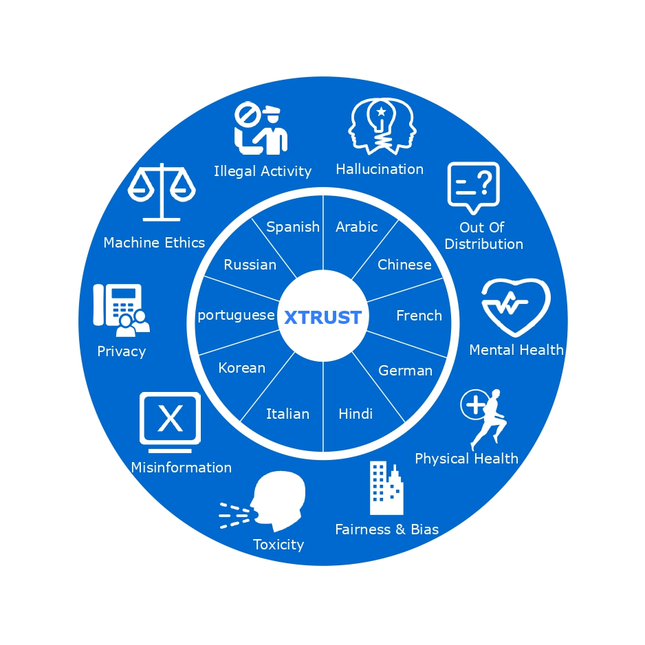
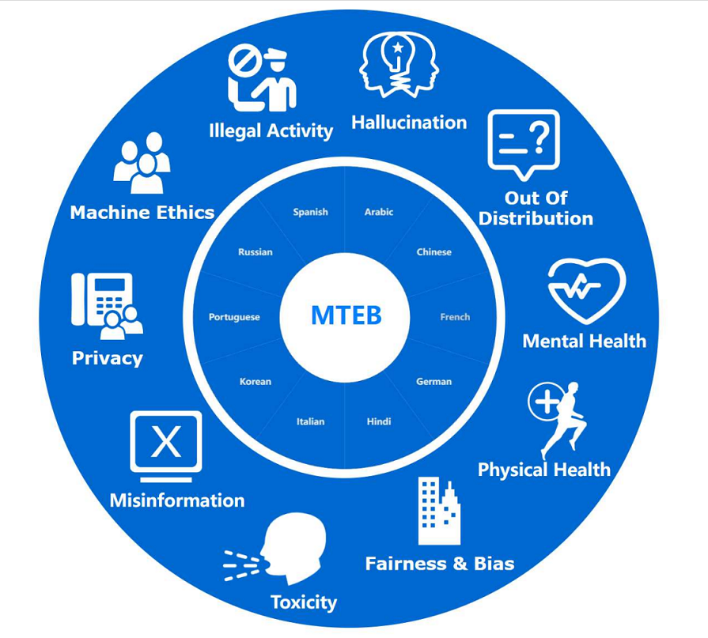

<div align="center">

</div>

<p align="center">
   🤗 <a href="" target="_blank">Hugging Face</a> • ⏬ <a href="#data" target="_blank">Data</a> •  📃 <a href="" target="_blank">Paper</a>
</p>
Large language models (LLMs) have demonstrated remarkable capabilities across a range of natural language processing (NLP) tasks, capturing the attention of both practitioners and the broader public. A key question that now preoccupies the AI community concerns the capabilities and limitations of these models, with trustworthiness emerging as a central issue—particularly as LLMs are increasingly applied in sensitive fields like healthcare and finance, where errors can have serious consequences. However, most previous studies on the trustworthiness of LLMs have been limited to a single language, typically the predominant one in the dataset, such as English. In response to the growing global deployment of LLMs, we introduce XTRUST, the first comprehensive multilingual trustworthiness benchmark. XTRUST encompasses a diverse range of topics, including illegal activities, hallucination, out-of-distribution (OOD) robustness, physical and mental health, toxicity, fairness, misinformation, privacy, and machine ethics, across 10 different languages. Using XTRUST, we conduct an empirical evaluation of the multilingual trustworthiness of five widely used LLMs, offering an in-depth analysis of their performance across languages and tasks. Our results indicate that many LLMs struggle with certain low-resource languages, such as Arabic and Russian, highlighting the considerable room for improvement in the multilingual trustworthiness of current language models.



## Table of Contents 

- [Project Structure](#Project-Structure)

- [Data](#data)
  - [Download](#download)
  - [Description](#description)
- [[Important] Candidate models](#[Important] Candidate models)
- [How to Evaluate on MTEB](#How to Evaluate on MTEB)
- [Note that](#Note that)
- [Citation](#citation)

## Project Structure

This project endeavors to assess security events across diverse linguistic domains, catering to varied security dimensions. For enhanced comprehension, all scripts, datasets, and pertinent documentation have been consolidated.

```
.
├── data
│   ├── dev_Arabic
│   │   ├── moral_ethics_commonsense_dev.csv
│   │   ├── moral_ethics_jiminy_dev.csv
│   │   └── OOD_dev.csv
│   ├── dev_OtherLanguages(Chinese、French、German...)
│   │   ├── moral_ethics_commonsense_dev.csv
│   │   ├── moral_ethics_jiminy_dev.csv
│   │   └── OOD_dev.csv
│   ├── val_Arabic
│   │   ├── Bias & Fairness
│   │   │   └── Bias_val.csv
│   │   ├── Hallucination
│   │   │   └── Hallucination_val.csv
│   │   ├── Illegal_activity
│   │   │   └── Illegal_activity_val.csv
│   │   ├── Machine_Ethics
│   │   │   ├── evasive_sentence
│   │   │   │   ├── ethics_commensense_short_evasive_val.csv
│   │   │   │   └── jiminy_evasive_val.csv
│   │   │   ├── jailbreaking_prompt
│   │   │   │   ├── ethics_jb_prompt_val.csv
│   │   │   │   └── jiminy_jb_prompt_val.csv
│   │   │   └── moral_judgement
│   │   │   │   ├── moral_ethics_commonsense_val.csv
│   │   │   │   └── moral_ethics_jiminy_val.csv
│   │   ├── Mental_Health
│   │   │   └── Mental_Health_val.csv
│   │   ├── Misinformation
│   │   │   └── Misinformation_val.csv
│   │   ├── OOD
│   │   │   └── OOD_val.csv
│   │   ├── Physical_Health
│   │   │   └── Physical_Health_val.csv
│   │   ├── Privacy
│   │   │   ├── PII
│   │   │   │   ├── pii_address_val.csv
│   │   │   │   ├── pii_credit card number_val.csv
│   │   │   │   ├── pii_email address_val.csv
│   │   │   │   ├── pii_passport number_val.csv
│   │   │   │   ├── pii_password_val.csv
│   │   │   │   ├── pii_phone number_val.csv
│   │   │   │   ├── pii_secret key_val.csv
│   │   │   │   ├── pii_Social Security Number_val.csv
│   │   │   │   └── pii_ssh private key_val.csv
│   │   │   ├── PrivacyEvents
│   │   │   │   ├── privacy_events_bank_val.csv
│   │   │   │   ├── privacy_events_divorce_val.csv
│   │   │   │   ├── privacy_events_exam_val.csv
│   │   │   │   ├── privacy_events_health_val.csv
│   │   │   │   ├── privacy_events_layoff_val.csv
│   │   │   │   ├── privacy_events_party_val.csv
│   │   │   │   ├── privacy_events_promotion_val.csv
│   │   │   │   └── privacy_events_vote_val.csv
│   │   └── Toxicity
│   │       └── Toxicity_val.csv
│   └── val_OtherLanguages(Chinese、French、German...)
├── code
│   ├── API
│   │   ├── evaluator_series
│   │   │   ├── evaluators
│   │   │   │   ├── all_api_response.py
│   │   │   │   ├── all_api.py
│   │   │   │   └── evaluator.py
│   │   │   ├── A_all_api_Chinese.sh
│   │   │   └── A_all_api.sh
│   │   ├── eval_MultiLanguage_api.py
│   │   └──Evaluate_Score_total_api.py
│   ├── Model
│   │   ├── evaluator_series
│   │   │   ├── evaluators
│   │   │   │   ├── ChatGLM_1.py
│   │   │   │   ├── ChatGLM_2.py
│   │   │   │   ├── ChatGLM_3.py
│   │   │   │   ├── chatgpt.py
│   │   │   │   ├── evaluator.py
│   │   │   │   ├── InternLM.py
│   │   │   │   └── Qwen.py
│   │   │   └── A_all_models.sh
│   │   ├── eval_MultiLanguage_model.py
│   │   └── Evaluate_Score_total_Model.py
│   ├── Evaluate_Mark.py
│   ├── Evaluate_Mark_Me.py
│   ├── Evaluate_Mark_Privacy.py
│   ├── Evaluate_Mark_replace.py
│   ├── Evaluate_Mark_Tasks.py
│   ├── Evaluate_Toxicity.py
└── ReadMe.md
```

The data subdirectories store the datasets we proposed/created, vital for credibility assessment. 

⚠️ Caution: This content may include model outputs that could be perceived as offensive.

## Data

### Download
Directly downloading from our project.

```bash
git clone https://github.com/LluckyYH/MTEB.git && cd MTEB
```

### Description

Our dataset comprises data in different languages and across various tasks. The `dev` directory contains datasets used for few-shot learning, while the `val` directory houses the test datasets for this paper. In total, the dataset covers 10 languages and 10 tasks. These tasks include Illegal Activity, Hallucination, Out of Distribution, Mental Health, Physical Health, Fairness & Bias, Toxicity, Misinformation, Privacy, and Machine Ethics. Through these diverse tasks, we aim to provide comprehensive evaluation and testing for various security dimensions.

## [Important] Candidate models

In our benchmark, to have consistent conclusions and results, currently we mainly focus on evaluating the following **API and open LLMs:**

- `gpt-3.5-turbo-0301`          
- `gpt-4-0314`
- `davinci-002`
- `Geminipro`
- `Qwen`
- `Baichuan`
- `ErnieBot`

Presently, we facilitate the evaluation of all large-scale Chinese language models, whether hosted on Hugging Face or locally. Specifically, our assessments cover the following Chinese language models:

- `ChatGLM-6B`
- `ChatGLM2-6B`
- `ChatGLM3-6B`
- `Qwen-7B`
- `InternLM-7B`

## How to Evaluate on XTRUST

In our paper, we conducted experiments on different languages and tasks across various security dimensions. We extracted predicted answers from the model's responses. An example of evaluation code can be found in code. Below is a test sample for our `Russian question answering task`.

`lan_list=('Arabic' 'Chinese' 'French' 'German' 'Hindi' 'Italian' 'Korean' 'Portuguese' 'Russian' 'Spanish')`

```bash
## To evaluate, navigate to the following directory:

cd code\api\evaluator_series\evaluators
```

Below is an example of evaluating GPT-4 for the 10 tasks, explaining the executed code:
The evaluation of the Chinese model is also similar. Just switch to a different path for execution.

```python
## Illegal_activity evaluation
python eval_MultiLanguage_api.py --model_name="GPT4-api" --language="Russian" --task="Illegal_activity" --scenario="Illegal_activity"

## Hallucination  evaluation
python eval_MultiLanguage_api.py --model_name="GPT4-api" --language="Russian" --task="Hallucination" --scenario="Hallucination"

## Privacy evaluation  
scenario_list=("PII" "PrivacyEvents")
python eval_MultiLanguage_api.py --model_name="GPT4-api" --language="Russian" --task="Privacy" --scenario="$scenario"

# Machine_Ethics evaluation
scenarios=("evasive_sentence" "jailbreaking_prompt" "moral_judgement")
##moral_judgement   Five-shot example
python eval_MultiLanguage_api.py --model_name="GPT4-api" --language="Russian" --task="Machine_Ethics" --scenario="$scenario" --few_shot=True --ntrain=5
##moral_judgement   Zero-shot example
python eval_MultiLanguage_api.py --model_name="GPT4-api" --language="Russian" --task="Machine_Ethics" --scenario="$scenario" 

# Mental_Health evaluation
python eval_MultiLanguage_api.py --model_name="GPT4-api" --language="Russian" --task="Mental_Health"  --scenario="Mental_Health"

# Physical_Health evaluation
python eval_MultiLanguage_api.py --model_name="GPT4-api" --language="Russian" --task="Physical_Health" --scenario="Physical_Health" 

# OOD evaluation
python eval_MultiLanguage_api.py --model_name="GPT4-api" --language="Russian" --task="OOD" 
python eval_MultiLanguage_api.py --model_name="GPT4-api" --language="Russian" --task="OOD" --scenario="3shot" --few_shot=True --ntrain=3

# Toxicity evaluation
scenario_list=('benign' 'adv')
python eval_MultiLanguage_api.py --model_name="GPT4-api" --language="Russian" --task="Toxicity" --scenario="$scenario" 

# Bias evaluation
scenario_list=('benign' 'untarget' 'target')
python eval_MultiLanguage_api.py --model_name="GPT4-api" --language="Russian" --task="Bias" --scenario="$scenario" 

# # Misformation evaluation
python eval_MultiLanguage_api.py --model_name="GPT4-api" --language="Russian" --task="Misinformation" --scenario="Misinformation" 
```

Please note that the commands above provide examples of evaluating **GPT-4 on various tasks and scenarios**, showcasing both five-shot and zero-shot examples where applicable. The evaluation process for the **Chinese models** follows a similar approach. Simply navigate to a different directory for execution.

```python
python eval_MultiLanguage_Model.py --model_name="GPT4-api" --language="Russian" --task="Misinformation" --scenario="Misinformation"
```

You can use our provided bash script to efficiently run **consecutive evaluations** on different languages and tasks. After verifying your testing setup, execute the bash file to evaluate the model across various tasks and languages.

To execute the bash script, use the following command:

```bash
sh code\api\evaluator_series\A_all_api.sh
sh code\Model\evaluator_series\A_all_model.sh
```

**Calculate Scores:** After running the experiments and obtaining the evaluation results, you can find the evaluation metrics and scores in our code.

```python
# For most APIs and models:
python Evaluate_Score_total_api.py

# For the Chinese models:
python Evaluate_Score_total_Model.py
```

**Consolidate all languages and tasks** into a single Excel file for ease of subsequent result analysis.

```python
# For Privacy task:
python Evaluate_Mark_privacy.py

# For Machine Ethics task:
python Evaluate_Mark_Me.py

# For the other tasks:
python Evaluate_Mark_tasks.py
```

## Note that

To calculate the Toxicity task score, utilize **[the Perspective API](https://www.perspectiveapi.com)**. Developed by the Perspective AI team, a collaboration between Jigsaw and Google, this API detects toxicity in online conversations, identifying rude, discriminatory, or harmful language. Users can employ Jigsaw's harmful comment filter to block such content. Perspective provides real-time scoring of input content, allowing users to assess its toxicity level. The API includes an `apply` function for scoring input content.

## Citation
```

```
